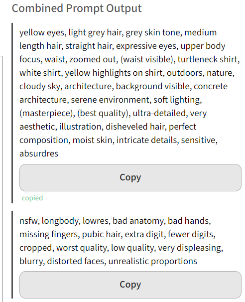
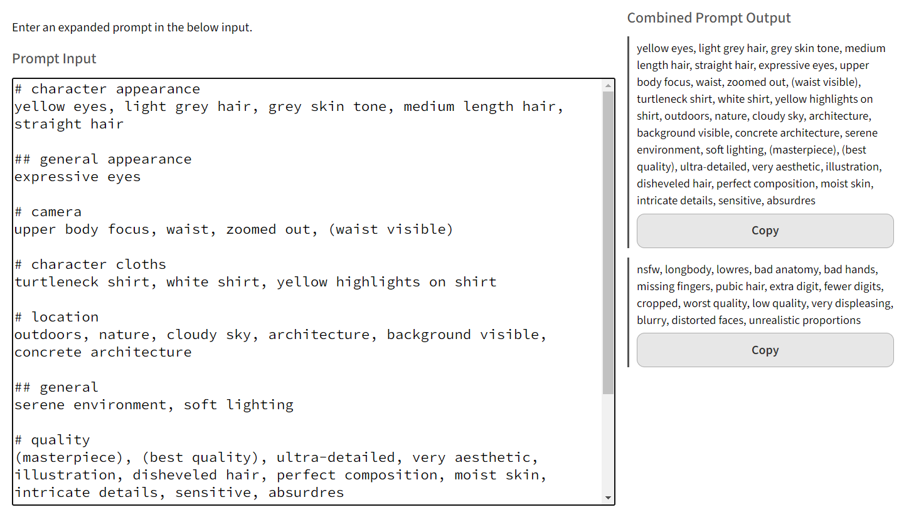

# Prompt Combiner
https://risonakamo.github.io/prompt-combiner/

Tool to convert "expanded prompt", which looks like markdown:

```markdown
# character appearance
yellow eyes, light grey hair, grey skin tone, medium length hair, straight hair

## general appearance
expressive eyes

# camera
upper body focus, waist, zoomed out, (waist visible)

# character cloths
turtleneck shirt, white shirt, yellow highlights on shirt

# location
outdoors, nature, cloudy sky, architecture, background visible, concrete architecture

## general
serene environment, soft lighting

# quality
(masterpiece), (best quality), ultra-detailed, very aesthetic, illustration, disheveled hair, perfect composition, moist skin, intricate details, sensitive, absurdres

---

# (-) bad quality
nsfw, longbody, lowres, bad anatomy, bad hands, missing fingers, pubic hair, extra digit, fewer digits, cropped, worst quality, low quality, very displeasing, blurry, distorted faces, unrealistic proportions
```

Into a regular comma-separated list, which can then be copied:



With this, you can organise your prompts as markdown files and easily copy paste into generator.



# Expanded Prompt Syntax
[Info about expanded prompt](./doc/expanded_prompt_rules.md)

# Dev notes
[dev notes](./doc/dev-notes.md)